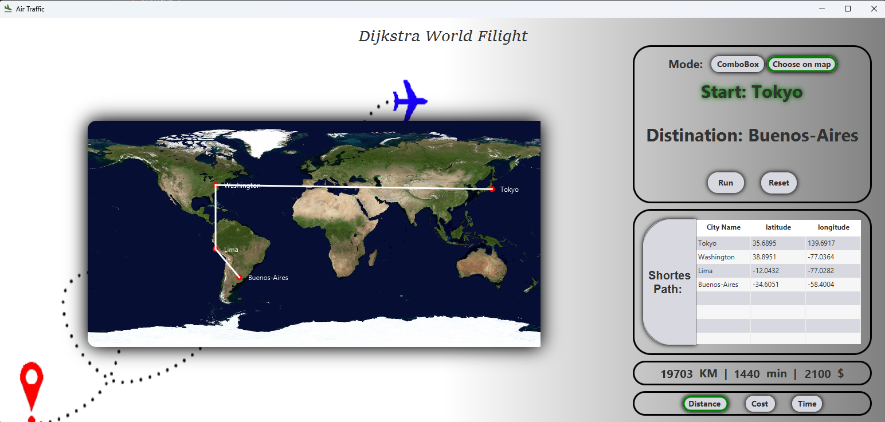
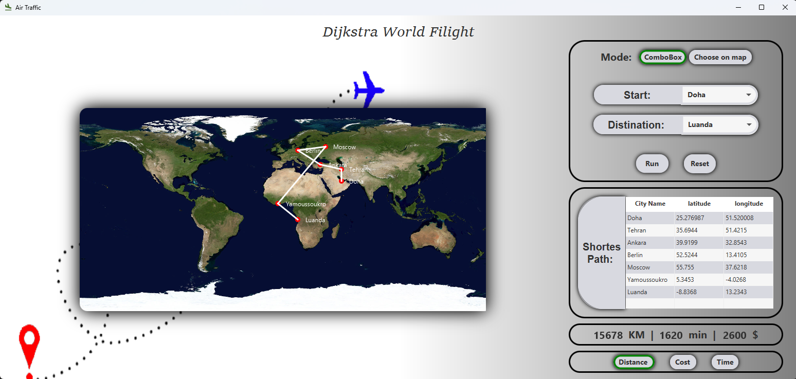

## 🚀 Features
- **Dijkstra's Algorithm**: Computes the shortest flight path based on distance, cost, or time.
- **Interactive UI**: Allows users to select cities and view real-time route calculations.
- **Graph Visualization**: Displays the shortest path on a world map with connected flight routes.
- **City Data Table**: Shows city names along with their latitude and longitude.
- **Multiple Modes**: Choose from distance, cost, or time as optimization criteria.

## 📷 Screenshots
### Travel by choosing on map
  

### Travel by selecting cities form comboBox
  
## 🛠️ Technologies Used
- **JavaFX**: For UI design and graphical visualization.
- **Dijkstra's Algorithm**: To compute the optimal flight path.
- **Geographical Data**: Used for city coordinates and mapping.

## 🎯 Future Enhancements
- Add real-time flight data integration.
- Implement additional optimization metrics like fuel efficiency.
- Enhance UI with more interactive elements.
